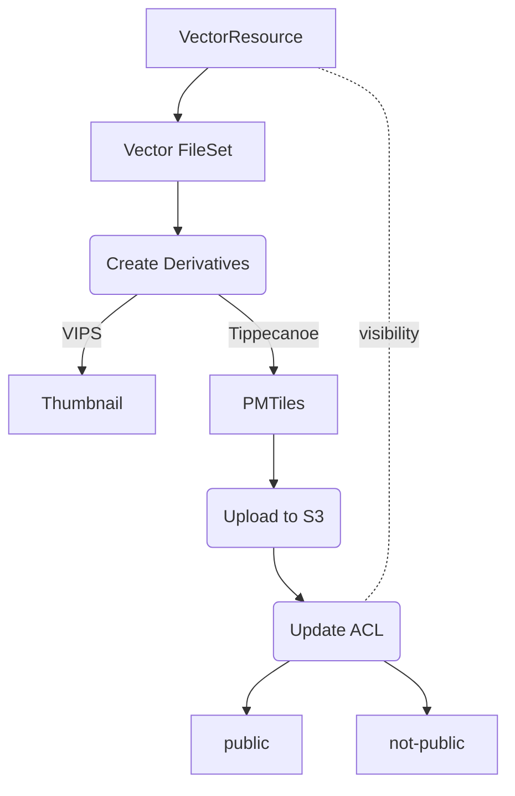
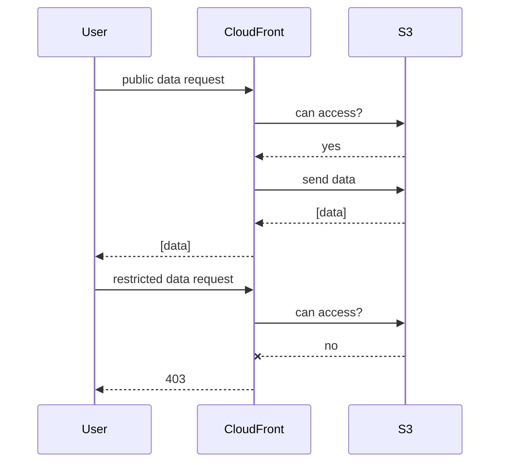
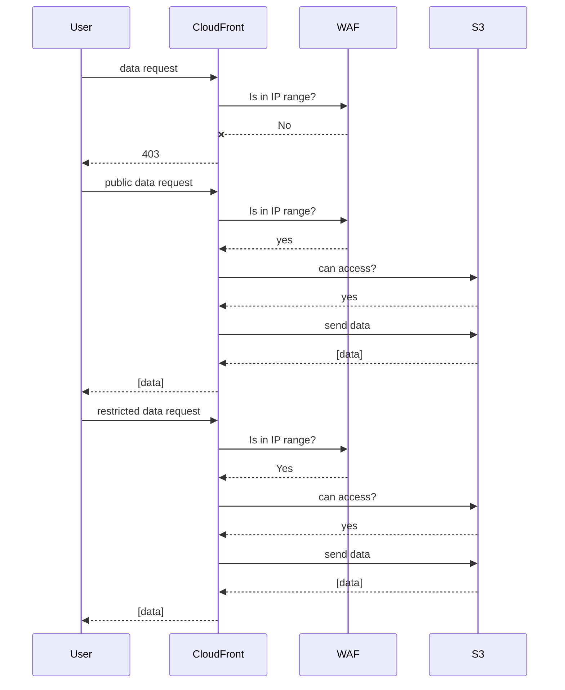

# Architecture of PMTiles functionality

We generate vector derivatives in [PMTiles format](https://github.com/protomaps/PMTiles)
and upload to Amazon S3. The ACL for these is set as "public" or "non-public"
based on the visibility of the parent VectorResource. An AWS CloudFront distribution
serves requests to public data for users both within and outside of Princeton network
IP ranges. A second AWS CloudFront distribution will serve requests to public and
restricted data only for users within Princeton network IP ranges.

For deployment, we use this [AWS CDK Project](https://github.com/pulibrary/geoservices-aws).

## Creating new vector FileSet

## Requesting data from public CloudFront distribution

## Requesting data from restricted CloudFront distribution

- The restricted distribution is connected to a Web Application Firewall to filter requests by IP
address.
- To update the list of approved IP addresses and ranges, deploy the CDK geodata
stack. The
[script](https://github.com/pulibrary/geoservices-aws/blob/main/helpers/ip_list.py) will resolve the GlobalProtect FQDNs and send the updated list to the WAF.

