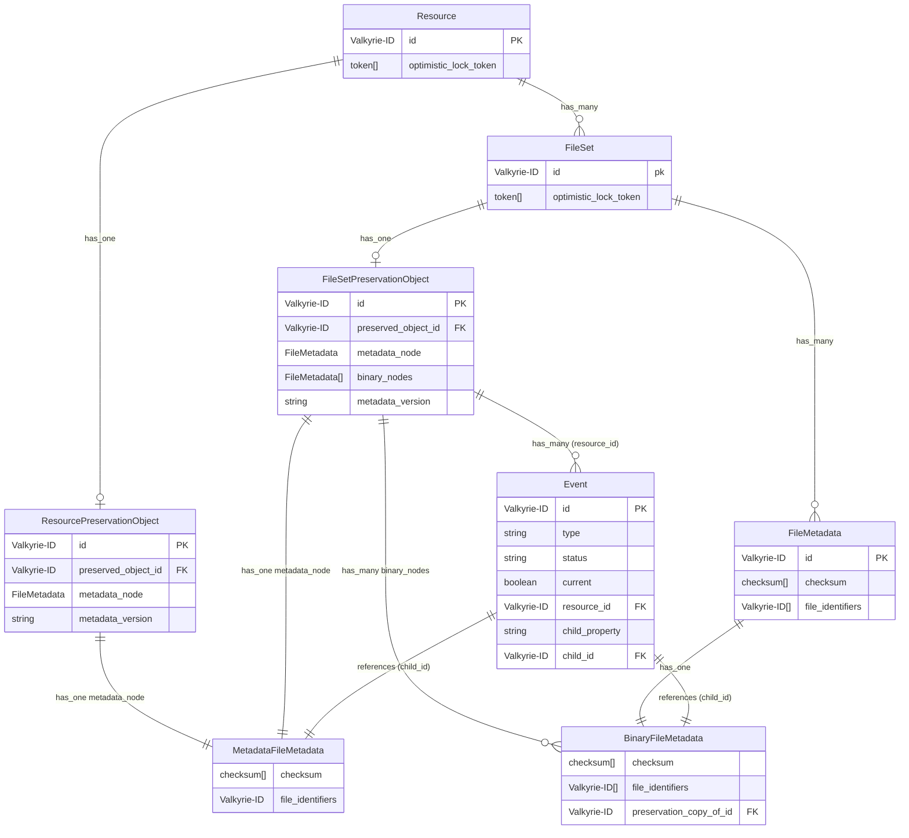
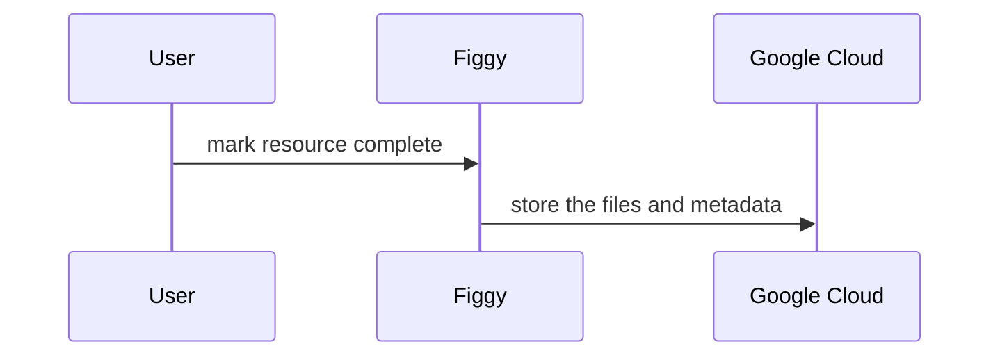
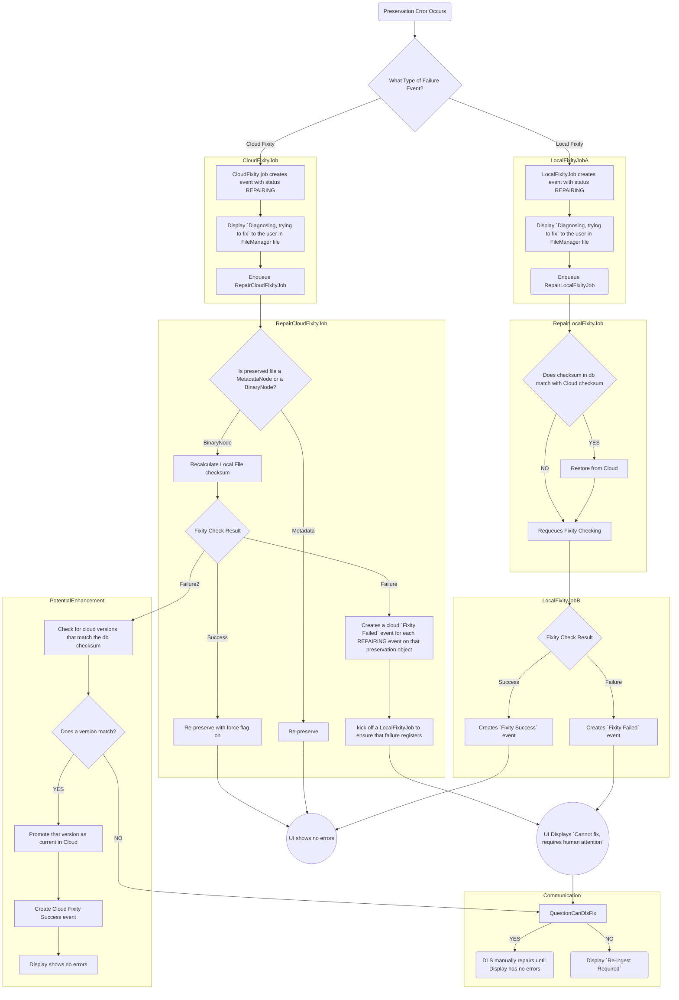

# Implementation Diagram

`FileSetPreservationObject` and `ResourcePreservationObject` are separated below for visual purposes - both in the code are `PreservationObject`. Similarly, `MetadataFileMetadata` and `BinaryFileMetadata` are both `FileMetadata`.

## Preservation

Preservation is triggered when a resource is marked complete by `ChangeSetPersister::PreserveResource` and runs so long as `ChangeSet.for(resource).preserve?` returns true.

### Scanned Resource Walkthrough
Scenario: The ScannedResource is completed.

1. `ChangeSet::PreserveResource` is run, checking `ChangeSet.for(resource).preserve?`
   * Default `ChangeSet#preserve?`: https://github.com/pulibrary/figgy/blob/426da54c79bbbd08216f8edb05f034f3659ab41e/app/change_sets/change_set.rb#L108-L118
2. Enqueue `PreserveResourceJob`, which runs `Preserver#preserve!`
3. Create a `PreservationObject` for the `ScannedResource`
   * We use PreservationObject to save the cloud / preserved locations of preservation files, so that we don't add new metadata values to the objects that we are preserving, thus necessitating another preservation action.
4. Preserve metadata
   * A JSON serialization of the metadata is uploaded to Google Cloud (GCS) and its checksum stored in the `metadata_node` attached to the PreservationObject.
   * The PreservationObject's `metadata_version` field is updated with the `Resource`'s current lock token, so we can ensure that the `PreservationObject` and `Resource` are in sync.
5. Enqueue preservation of children.
   * Every time it's run the preserver will automatically enqueue preservation of any children which have never been preserved.

### FileSet Walkthrough

Scenario: The ScannedResource with one FileSet is completed.
* PreserveChildrenJob queues a PreserveResourceJob for each of the members.
* PreserveResourceJob is just a wrapper for the Preserver class.
* `preserve!` creates a `PreservationChecker::Binary` for each file metadata on the FileSet. Gives an option to force the preservation, otherwise only preserves if it hasn't been preserved before.
* After it preserves the binary nodes, it preserves the metadata, as outlined above. It doesn't have any children to preserve.

### Cloud Fixity Check

Scenario: A preserved object exists in Google Cloud
Note: Some of this process is documented in [ADR #4, Preservation Fixity](https://github.com/pulibrary/figgy/blob/main/architecture-decisions/0004-preservation-fixity.md).
* The `request_daily_cloud_fixity` task is run 9PM everyday.
  * https://github.com/pulibrary/figgy/blob/150e9def951fd0b1ea8f948069f5a0225fff4f4f/config/schedule.rb#L19
* The task runs the `CloudFixity::FixityRequestor.queue_daily_check!` method with an 10% annual ratio.
  * https://github.com/pulibrary/figgy/blob/3276f1923c80b3b26929228b7b2fecebf9a90ef8/lib/tasks/fixity_worker.rake#L13
  * The method computes the number of the resources that need to be checked to satisfy the annual ratio, and publishes file information to a fixity request Google PubSub topic.
* In Google Cloud, we have a [Cloud Function](https://github.com/pulibrary/figgy/blob/150e9def951fd0b1ea8f948069f5a0225fff4f4f/cloud_fixity/index.js) that listens to the fixity request topic.
  * A compute promise is constructed that pipes the file into an md5 hash.
  * If the calculated md5 value equals the md5 value passed in the request data, then a 'success' message is published. If not, a 'failure' message is published.
  * If there is an error when streaming the file, a retry_count attribute is added to the request data and it is re-queued. After 5 attempts, a 'failure' message is published.
  * A message gets published to the fixity status topic queue.
  * Cloud Fixity Worker kicks off a UpdateFixityJob which results in an Event getting saved, and notifies Honeybadger if there's a failed fixity check.

### Local Fixity Check
Scenario: A new file is ingested.
* After ingesting, CharacterizationJob runs (creates checksums), then runs
    CreateDerivativesJob
* After derivatives are created in CreateDerivativesJob, it calls
    LocalFixityJob via perform_later.
  * Calls `run_fixity` on the file set, which delegates to the primary_file
      * Runs checksums on the file on disk and compares it to the previously
          stored checksum. If it matches, it creates a success Event.

Scenario: A FileSet exists in Figgy, it should be occasionally confirmed its
fixity is correct.
* `rake figgy:fixity:request_daily_local_fixity` is run every day. It checks a random 1/365th of the repository every day.

### Fixity failures: Autofix

When a cloud or local fixity check results in a failure, figgy attempts to
autofix by first creating an event with status "REPAIRING" and then attempting
to recover the file and represerve.

### Fixity status show page display
Scenario: Looking at a Scanned Resource

We display fixity summary in three places:

#### Resource Show Page

On a resource we display fixity check information in a Health Status area at the
top right of the page:

https://github.com/pulibrary/figgy/blob/aa3f248081e866884b4aa962e6ca270c94a0e426/app/views/catalog/show.html.erb#L8

It uses a HealthReport object, which it creates via a helper method:

https://github.com/pulibrary/figgy/blob/aa3f248081e866884b4aa962e6ca270c94a0e426/app/helpers/application_helper.rb#L78

The HealthReport queries for the relevant Events on the resource itself and all
resources and filesets it comprises.

#### File Manager error notifications

If a given file has fixity errors they will show as notifications below the
file's thumbnail on the File Manager page.

https://github.com/pulibrary/figgy/blob/aa3f248081e866884b4aa962e6ca270c94a0e426/app/views/base/_file_manager_member.html.erb

#### File Set Show Page

https://github.com/pulibrary/figgy/blob/aa3f248081e866884b4aa962e6ca270c94a0e426/app/views/catalog/_members_file_set.html.erb

This has a column for local fixity and cloud fixity for every FileMetadata. Any
preserved file will have information, and other types of files display an
informative message about their preservation status.

https://github.com/pulibrary/figgy/blob/aa3f248081e866884b4aa962e6ca270c94a0e426/app/views/catalog/_file_detail.html.erb

This uses some helpers, `format_fixity_success` and `format_cloud_fixity_success`, and also displays the last success date for each.

### Fixity Dashboard

The code here is very straightforward. See FixityDashboardController and
accompanying template / partials.

### Creation of Deletion Markers

There's a CreateDeletionMarker before_delete hook in the change set persister.

It saves some identifiers and embeds the preservation object.

The DeletionMarker model: https://github.com/pulibrary/figgy/blob/main/app/models/deletion_marker.rb

### Restore from Deletion Markers

#### Restoring from file manager

When a fileset has been deleted there's a "Deleted Files" section in the File Manager. Each deleted file is listed by title with a "Reinstate" button. There's a `child_deletion_markers` method on the wayfinder to power this list. Uses the parent_id stored on the tombstone. Currently only implemented for ScannedResources.

- Restoration uses a deletion_marker_restore_ids param to pass the value to the restore_from_deletion_markers.rb change_set_persister callback.
- Preserver::Importer.from_preservation_object pulls the metadata and binary down from the cloud.
- The metadata is converted back into a FileSet object using the Valkyrie Sequel ORM converter. This restores id, created date, updated date, PCDM use, and internal resource.
- The callback then adds the fileset back onto the resource as a member.

#### Restoring via search

All DeletionMarkers can be searched using the "Search Deletion Markers" link on the home page of figgy. There's a "Restore" button on each deletion marker show page, which enqueues a RestoreFromDeletionMarkerJob.

- The job wraps the DeletionMarkerService, which calls Preserver::Importer.from_preservation_object
- After the resource is restored, it is re-attached to its parent (stored on the preservation object) and its members are recursively restored.

### Blind Importer

If a DeletionMarker is not present, such as when the database has been lost or a bug has caused the PostgreSQL row to be deleted, preserved resources can still be recovered by using the `BlindImporter`, which will import any resource ID from its path in preservation storage.

You have to call BlindImporter from the rails console.

- BlindImporter uses FileMetadataAdapter's query_service which navigates Google Cloud.
- It recurses through resource membership and imports every member.
- Instead of using FileAppender via `files: ` in the ChangeSet, it sets the `created_file_sets` property to trigger characterization/derivatives.
- FileMetadataAdapter::ConvertLocalStorageIDs converts preserved file identifiers to their GCS counterparts, and makes sure they all exist, and returns the ones that exist.
