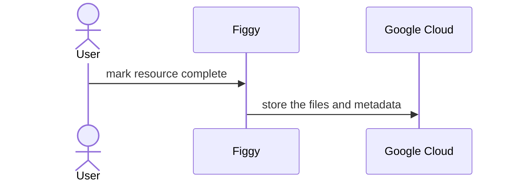

# Implementation Diagram

## Preservation

```mermaid
sequenceDiagram
  actor User
  participant Figgy as Figgy
  participant GCS as Google Cloud
  User->>Figgy: mark resource complete
  Figgy->>GCS: store the files and metadata
```

## Cloud Fixity Check

## Local Fixity Check
