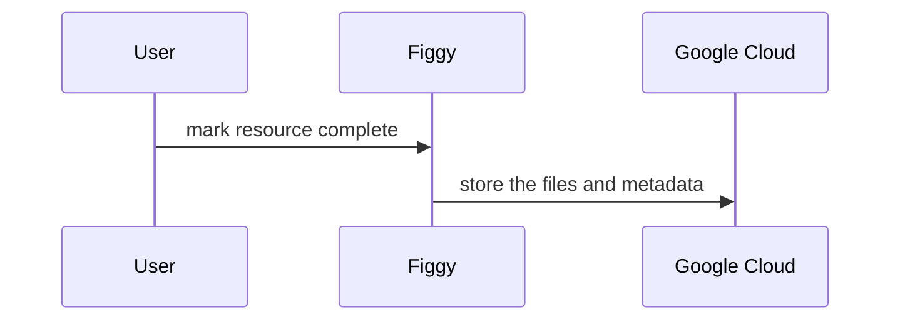

# Implementation Diagram

## Preservation

### Scanned resource walkthrough
Scenario: The ScannedResource is completed.
* the ChangeSetPersister::PreserveResource is run as an after_save_commit callback.
  * calls `preserve?` on the change set.
  * https://github.com/pulibrary/figgy/blob/5526-preservation/app/change_set_persisters/change_set_persister/preserve_resource.rb
* in the change set,
  * It has to be persisted
  * If there's a parent, return the preserve? check from the parent
  * If state is complete, or it doesn't respond to `state`, then preserve
  * https://github.com/pulibrary/figgy/blob/d32622f0585375a3d3cb475a8193f6b345681838/app/change_sets/change_set.rb#L102-L112
* assuming preserve? true
  * if there are members, run PreserveResourceJob as `perform_now`.
  * If there aren't members, run PreserveResourceJob as `perform_later`. (mostly
    this codepath is for filesets, unlikely you want to complete a scanned
    resource that doesn't have any files)
* PreserveResourceJob is just a wrapper for the Preserver class.
* Preserver
  * `for` factory checks `change_set.preserve?` (again) so it doesn't do
    anything if that's false.
    * https://github.com/pulibrary/figgy/blob/d32622f0585375a3d3cb475a8193f6b345681838/app/services/preserver.rb#L6
  * `preserve!` will not do anything with binaries at this time since they are not attached to a scanned resource. The first time preserved, it will preserve both the metadata and members. Subsequent times preserved, it will only preserve metadata.
  * Uploads the serialized json metadata to Google Cloud (via Valkyrie::Shrine gem)
    * If the resource has changed its parent then it will re-preserve its
      children and clean up the old metadata file. In our scenario, that's hasn't happened.
  * Members are preserved asynchronously via a PreserveChildrenJob via SideKiq through the preserve_children method.
  * We use PreservationObject to save the cloud / preserved locations of these files, so that we don't add new metadata values to the objects that we are preserving, thus necessitating another preservation action.

### FileSet walkthrough
Scenario: The ScannedResource with one FileSet is completed.
* PreserveChildrenJob queues a PreserveResourceJob for each of the members.
* PreserveResourceJob is just a wrapper for the Preserver class.
* Preserver
  * `for` factory checks `change_set.preserve?` (again) so it doesn't do
    anything if that's false.
    * https://github.com/pulibrary/figgy/blob/d32622f0585375a3d3cb475a8193f6b345681838/app/services/preserver.rb#L6
* `preserve!` creates a PreservationIntermediaryNode for each file metadata on the FileSet. Gives an option to force the preservation, otherwise only preserves if it hasn't been preserved before.
* After it preserves the binary nodes, it preserves the metadata, as outlined above. It doesn't have any children to preserve.

## Cloud Fixity Check

## Local Fixity Check
