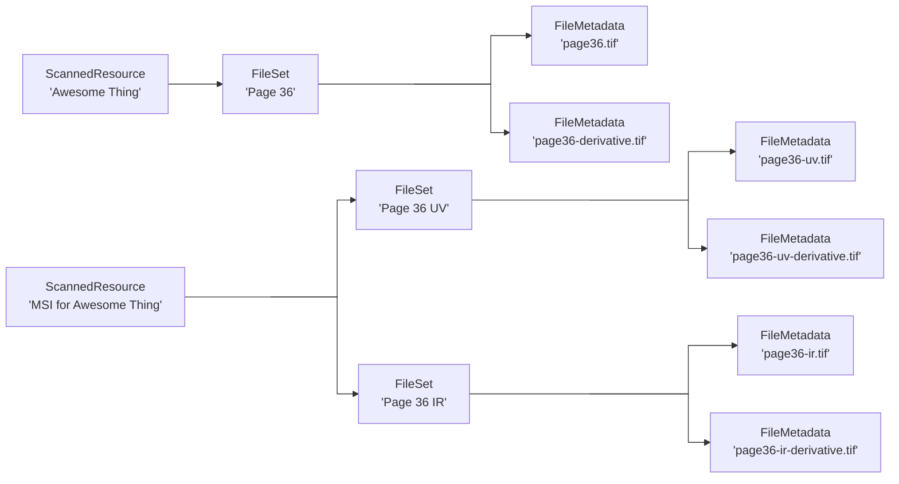

# Relationships

Here we document some known resource relationships and structures for certain use cases.

## Book w/ Pages


## Multi-Spectral Imaging (Current State)

We don't like this because we currently aren't associating the page images from one resource to another.


```
