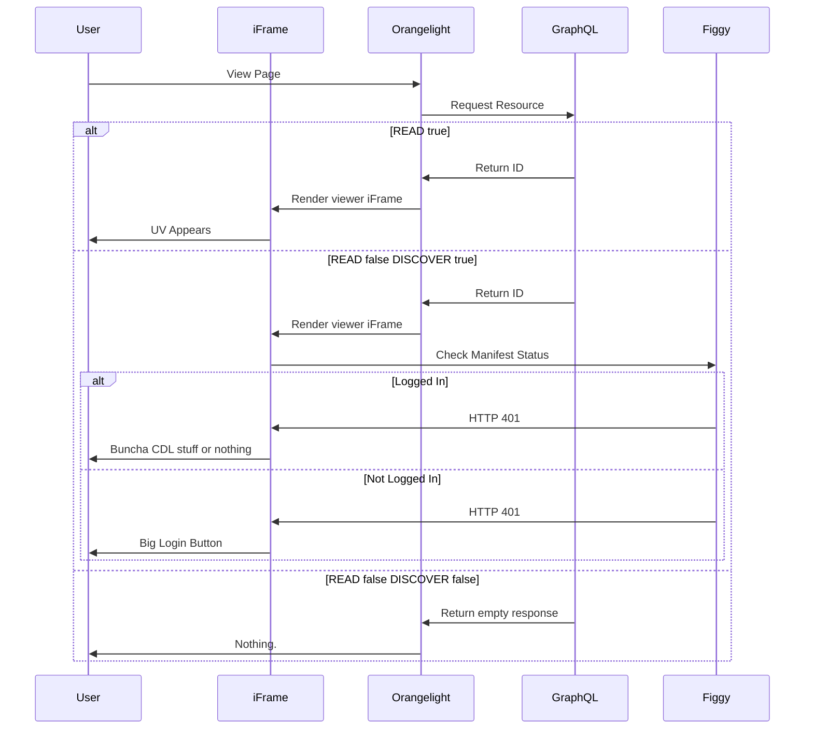
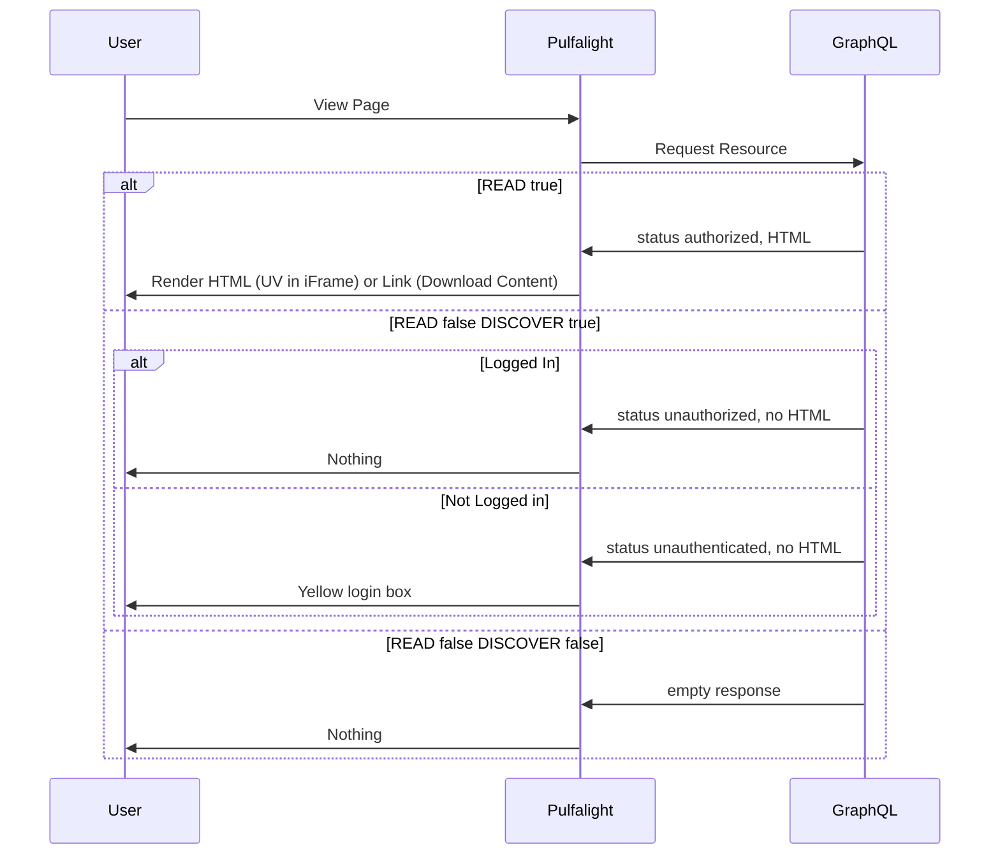

# Viewer Flow

The logic for determining which viewer screen to display to a user for a given
resource is complex. The workflow below attempts to summarize code split out in
various locations.

## GraphQL Version

