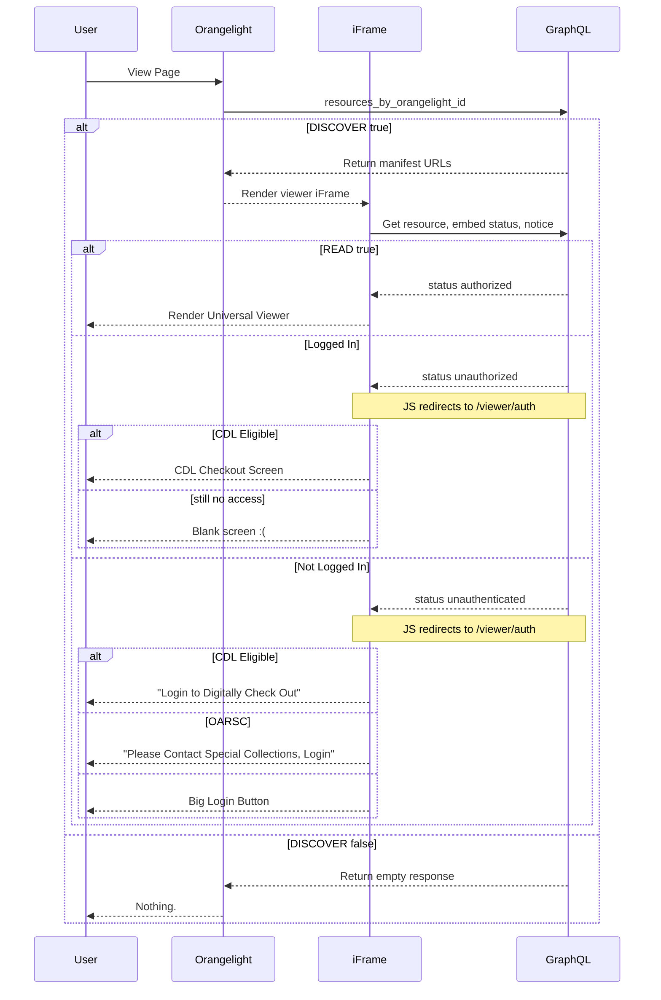
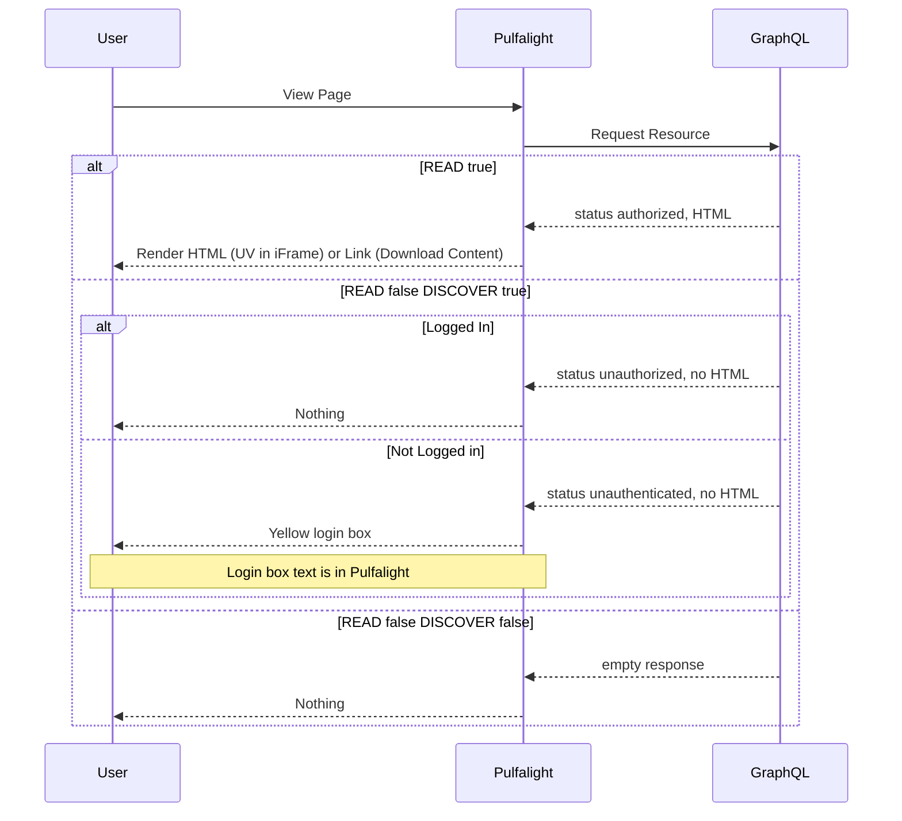

# Viewer Flow

The logic for determining which viewer screen to display to a user for a given
resource is complex. The workflow below attempts to summarize code split out in
various locations.

## Orangelight

Orangelight renders the viewer iFrame as long as the GraphQL returns a manifest
to render. Logic from that point forward is up to Figgy.

## Finding Aids

Finding Aids uses the GraphQL endpoint locally to see if it should render
anything, so that a blank screen or large login button never appears. Instead it
renders a little yellow login box informing users how to get access.

Finding Aids also needs support for rendering a button to download links for
content (zip files) - so instead of creating its own iFrame, it just renders
whatever Figgy asks it to render (either a link or an iFrame.)

