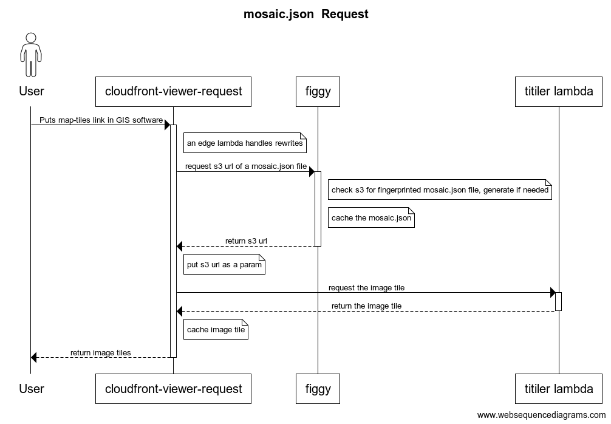

# Architecture of TiTiler and Figgy's tile service manifests

## TiTiler

TiTiler provides WMTS and XYZ endpoints, and serves the raster tiles associated with them. For a WMTS request, TiTiler generates the required manifest file (WMTSCapabilities.xml).

Our instance of titiler is deployed to aws lambda via [titiler-aws](https://github.com/pulibrary/titiler-aws). It's served at map-tiles.princeton.edu

When a client requests an actual tile from TiTiler, it reaches out to figgy to get the location of the current mosaic.json associated with that tile. TiTiler uses the mosaic.json file to determine which images are needed to generate the tile, and where they are located (on S3).


## Figgy

Figgy creates cloud derivatives when a raster is ingested.

Figgy generates mosaic.json, referencing these cloud derivatives, for any raster set or map set with raster descendants.

To ensure it's providing a mosaic.json with the most current and correct
details, Figgy calculates a fingerprint based on relevant file set contents of a
resource. (All raster file sets with a service_target of "tiles")


## Caching

* mosaic.json files are cached via rails caching. The fingerprint is included in the cache key.

* tiles themselves are cached in cloudfront.


## Sample object
* [India and Pakistan (pulmap)](https://maps.princeton.edu/catalog/princeton-dc1257b365d)
* [India and Pakistan (catalog)](https://catalog.princeton.edu/catalog/99125464907006421)
* [India and Pakistan (figgy)](https://figgy.princeton.edu/catalog/f97e8e8b-5bfe-466e-8c67-e17be912033e)

## Sequence Diagram



## Updating the sequence diagram

Go to websequencediagrams.com and enter the below:

```
title mosaic.json  Request

actor User
User -> +cloudfront-viewer-request: Puts map-tiles link in GIS software
note right of cloudfront-viewer-request: an edge lambda handles rewrites
cloudfront-viewer-request -> +figgy: request s3 url of a mosaic.json file
note right of figgy: check s3 for fingerprinted mosaic.json file, generate if needed
note right of figgy: cache the mosaic.json
figgy --> -cloudfront-viewer-request: return s3 url


note right of cloudfront-viewer-request: put s3 url as a param
cloudfront-viewer-request -> +titiler lambda: request the image tile
titiler lambda --> -cloudfront-viewer-request: return the image tile
note right of cloudfront-viewer-request: cache image tile
cloudfront-viewer-request --> -User: return image tiles
```
