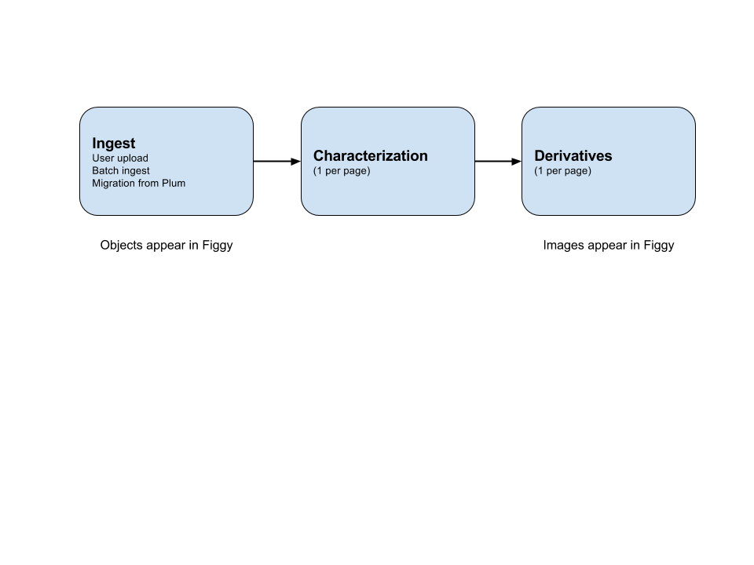

Figgy has several different kinds of ingest processes:
* User-initiated ingest, which uploads files from staging servers mounted
* Batch ingest of files on disk (e.g., files received from a scanning vendor)
* Migration of objects from Plum

All of these ingest processes use the same background workers to load and process files, and so they all follow the same basic process.  An ingest job creates objects in Figgy and imports metadata.  For each file, the ingest job kicks off a characterization job that extracts technical metadata from the file, and kicks off the appropriate derivative generation job.  In the case of TIFF master files, the derivative processing job generates JP2s and puts them on the image server.

A few things to note about this process:
* Staff users will be able to see the objects as soon as they are created.  But the images will not display until they have been characterized and have derivatives created.
* We currently have two queues: a high priority queue for user-initiated ingest, and a low priority queue for batch ingest.  So background workers will process bulk ingest jobs only when there are no user-initiated ingest jobs.
* Within each queue, the processing is mostly first-in-first-out, which means that if we queue up a large number of ingest jobs, they will all be processed before any of the files are characterized, and all of the files will be characterized before any of the derivatives are generated.  This effectively prioritizes getting files loaded into Figgy over generating derivatives so they can be viewed, and we could adjust this if we wanted to prioritize getting a single object finished instead.

